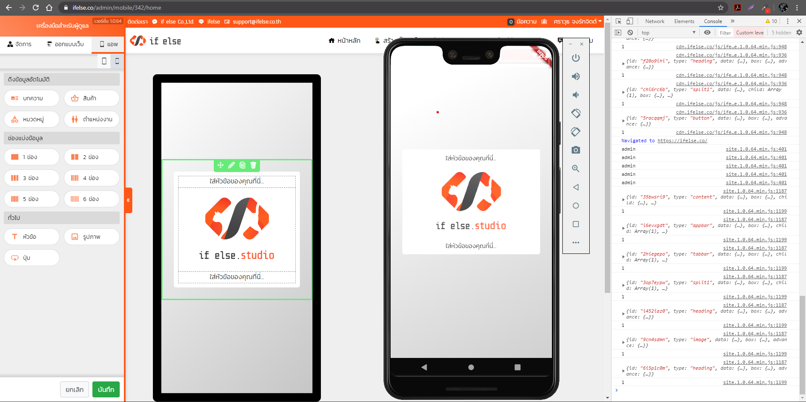

#### เริ่มพัฒนา 01/05/2563

# แอพมือถือสำเร็จรูป (Flutter)
แอพพลิเคชั่นมือถือแบบสำเร็จรูป ที่พัฒนาด้วย Flutter เพื่อให้รองรับสำหรับการใช้บน Android และ iOS 

โดยแอพนี้จะทำงานร่วมกับระบบเว็บไซต์ไซต์สำเร็จรูป https://ifelse.co เพื่อจัดการเนื้อหาและดีไซน์สำหรับการแสดงผลในแอพ

## การจัดการภายในแอพ
แอพจะดึงข้อมูลจากระบบภายในเว็บไซต์ที่เราสร้างไว้ ( หากยังไม่มีสามารถสมัครได้ฟรีที่ [https://ifelse.co](https://ifelse.co) ) เช่น
- ดีไซน์ส่วนต่างๆของแอพ เช่น ข้อความและสีในตำแหน่งต่างๆ, ไอคอนและรูปภาพ, รูปแบบการแสดงผลในแต่ละส่วน
- เนื้อหาต่างๆในเว็บ ตามที่เรากำหนดไว้ว่าจะแสดงอะไรบ้าง

## ลิขสิทธิ์
source code ชุดนี้ เปิดให้ใช้ฟรี และสามารถนำไปดัดแปลงเพิ่มเติมเองได้ตามความต้องการ.

## เกี่ยวกับเรา
[บริษัท อิฟ เอลซ์ จำกัด](https://ifelse.co.th) ผู้พัฒนาและให้บริการ[เว็บไซต์สำเร็จรูป](https://ifelse.co) และ[แอพพลิเคชั่นมือถือสำเร็จรูป](https://ifelse.co) #

