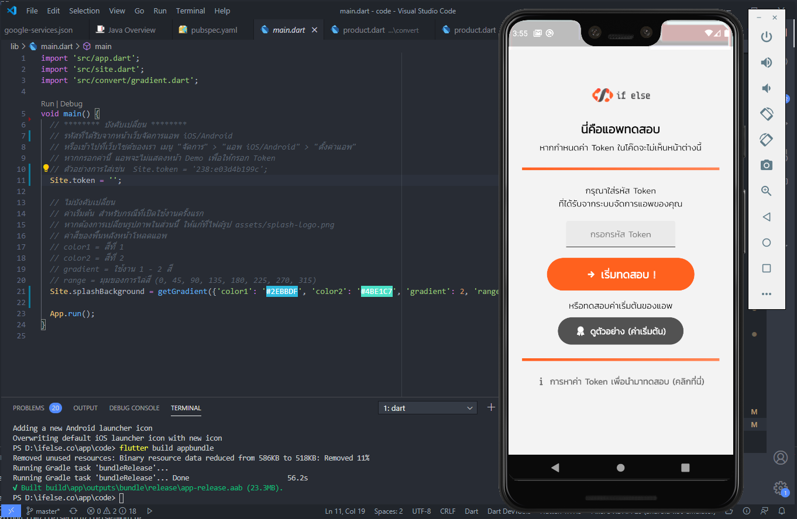

.  

## [วิดีโอการใช้งานเบื้องต้น](http://www.youtube.com/watch?v=7Cte73w959E)
 

## Changelog ###
28/07/2563
* รองรับการทดสอบการแสดงผลแอพที่ดีไซน์ไว้ผ่านแอพจริง โดยดาวน์โหลดแอพจาก Google Play, มาแล้วกรอกค่า Token ของแอพที่ได้จากหน้าเว็บ แอพจะสามารถแสดงผลการออกแบบแอพของเราได้ทันที  
  
02/06/2563
* รองรับการสร้างพื้นหลังแบบเส้นโค้ง

30/05/2563
* เพิ่มระบบ Shopping Cart รองรับ Stock, คำนวนค่าจัดส่ง, แจ้งชำระเงิน
* เริ่มเก็บ token สำหรับทำ push notification (ส่งกลับมายัง server)

24/05/2563
* ล็อคอินด้วย Google/Facebook รองรับทั้ง iOS/Android
* เพิ่มแก้ไขรูปโปรไฟล์/ข้อมูลส่วนตัว รองรับทั้ง iOS/Android
* เก็บ Cache ข้อมูลเทมเพลท และเปลี่ยนการสร้างหน้า Splash มาใช้ข้อมูลเทมเพลทสำหรับกรณีที่มีข้อมูลเทมเพลทใน cache

16/05/2563
* เปิดระบบจัดการแอพผ่านหน้าเว็บ โดยต้องกดติดตั้งธีมเริ่มต้นก่อนถึงจะใช้งานได้

15/05/2563
* เพิ่มกล่องข้อมูล สินค้า/ตำแหน่งงาน ทั้งหน้าลิสและหน้าเนื้อหา

13/05/2563
* ปุ่ม/รูปภาพ สามารถกำหนดการคลิก เพื่อเปิดเว็บไซต์ หรือแสดงหมวดบทความภายในแอพได้

12/05/2563
* Bottom Narbar สามารถใช้งานได้

11/05/2563
* ตั้ง Appbar/Navbar ลอยบนเนื้อหาได้
* เริ่มแสดง heading/paragraph/list/image ของเนื้อหาบทความ

01/05/2563
* เริ่มพัฒนา
 

# แอพมือถือสำเร็จรูป (Flutter)
แอพพลิเคชั่นมือถือแบบสำเร็จรูป ที่พัฒนาด้วย Flutter เพื่อให้รองรับสำหรับการใช้บน Android และ iOS 

โดยแอพนี้จะทำงานร่วมกับระบบเว็บไซต์ไซต์สำเร็จรูป https://ifelse.co เพื่อจัดการเนื้อหาและดีไซน์สำหรับการแสดงผลในแอพ
 

# เริ่มต้นออกแบบแอพจากหน้าเว็บ
1. สร้างเว็บไซต์ที่ ifelse.co
2. เลือกเมนู "แอพ" จากหน้าต่างเครื่องมือสำหรับผู้ดูแล
3. คลิกที่ปุ่ม ติดตั้งธีมเริ่มต้น (เฉพาะครั้งแรก)
4. เลือกแก้ไขแต่ละหน้าหน้าแอพ ได้จากลิสรายการ
 

# การทดสอบแอพ
- นำค่า Token ที่ได้จากหน้าเว็บ มากรอกที่แอพ ( [วิธีหาค่า Token](https://ifelse.co/docs/apps/token) )
- สามารถดาวน์โหลดแอพสำหรับทดสอบได้ที่ [Google Play](https://play.google.com/store/apps/details?id=co.ifelse.preview)

# การเปลี่ยน Icon ของแอพ
1. นำไฟล์รูปภาพขนาด 512x512 px ไปวางไว้ที่ตำแหน่งไฟล์ assets/icon/icon.png
2. แล้วรันคำสั่ง flutter pub run flutter_launcher_icons:main
3. ระบบจะเปลี่ยนไฟล์ icon ทุกขนาดของแอพนี้ให้อัตโนมัติ

# สั่ง build Android
ในส่วนนี้ยังไม่มีคู่มือ คาดว่าจะสามารถทำได้เมื่อระบบทั้งหมดเสร็จเรียบร้อยแล้ว แต่สามารถอธิบายคร่าวๆได้ดังนี้
1. สร้างแอพหรือโปรเจคใหม่ที่ firebase แล้วนำไฟล์ google-services.json มาวางไว้ที่ตำแหน่งไฟล์ android/app/google-services.json 
2. สร้างแอพที่ facebook app เพิ่ม Android GXhO platform และกรอกชื่อ package name ที่ใช้งานจริง แล้วนำ fb app id มาใส่ไว้ที่ไฟล์ android/app/src/main/res/values/strings.xml
* รายละเอียดจริงๆ จะทะยอยเพิ่มให้คราวหน้านะครับ
* การสั่ง build ไฟล์สำหรับนำไปอัพโหลดบท Google Play ให้พิมพ์คำสั่งด้านล่างนี้
  flutter build appbundle

## การจัดการภายในแอพ
แอพจะดึงข้อมูลจากระบบภายในเว็บไซต์ที่เราสร้างไว้ ( หากยังไม่มีสามารถสมัครได้ฟรีที่ [https://ifelse.co](https://ifelse.co) ) เช่น
- ดีไซน์ส่วนต่างๆของแอพ เช่น ข้อความและสีในตำแหน่งต่างๆ, ไอคอนและรูปภาพ, รูปแบบการแสดงผลในแต่ละส่วน
- เนื้อหาต่างๆในเว็บ ตามที่เรากำหนดไว้ว่าจะแสดงอะไรบ้าง
 

## ลิขสิทธิ์
source code ชุดนี้ เปิดให้ใช้ฟรี และสามารถนำไปดัดแปลงเพิ่มเติมเองได้ตามความต้องการ.

## เกี่ยวกับเรา
[บริษัท อิฟ เอลซ์ จำกัด](https://ifelse.co.th) ผู้พัฒนาและให้บริการ[เว็บไซต์สำเร็จรูป](https://ifelse.co) และ[แอพพลิเคชั่นมือถือสำเร็จรูป](https://ifelse.co) #

